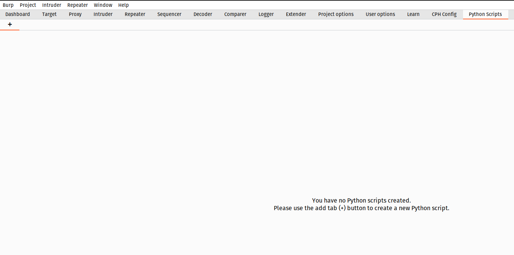
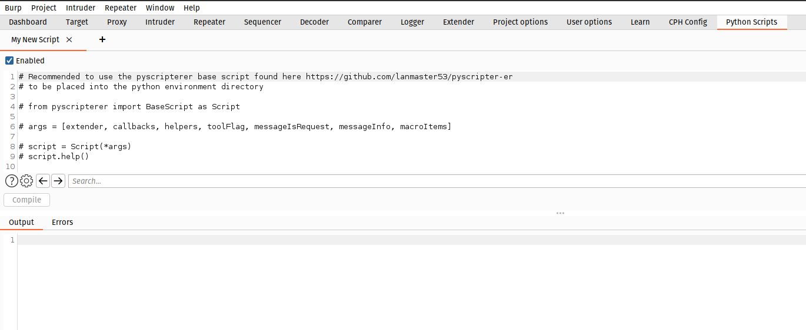
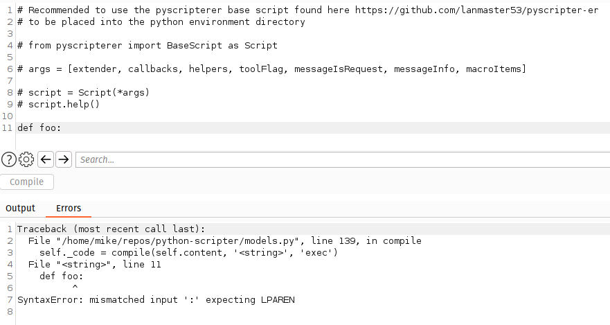

# Python Scripter

## Introduction

This extension allows you to write custom Python to hook into both the request, response pipeline and also the Macro handling support in Burp Suite. This is useful in those times were you want some behaviour but don't want to have to go to the full extent of creating a custom extension.

You can also over time build up a useful collection of utility scripts that can be used across web assessments.

I would highly recommend to build off the already established framework [pyscripter-er](https://github.com/lanmaster53/pyscripter-er) that already has a lot of common functionality built-in to save you some of the leg work.

## Usage

Once the extension is installed you will find a `Python Scripts` tab, this allows you to add, modify or remove scripts:

When you add a new script it will be given a name of `New Script X` this can be changed in the same way as in the `Repeater` tabs by double clicking and pressing Enter to confirm or Esc to cancel.

You can then start changing the new script or pasting a script from another location directly into the editor:

When your ready to compile the Python code simply click `Compile`, compile time errors these will be displayed in the `Errors` textarea:

To test the script simply enable it and then push through a request, output should be presented in the `Output` textarea:

If there was a runtime exception these will also be captured in the `Errors` textarea to help diagnose the bug.

__Scripts are automatically restored and saved on extension load and unload.__ 

## FAQs

__Q. Why do I see no output?__

A. As long as the script is enabled this could be that there was a runtime exception raised, firstly check the `Errors` textarea, could be that the scope checking in place is incorrect if your using `callbacks.isInScope` perhaps placing a `print` before and after this is comparesd coud help track down the issue. It may also be the case that the extension has an exception in which case you should check the `Errors` textare from the extensions dialog in Burp Suite. 

## Original Work

Sourced from gist: https://gist.github.com/mwielgoszewski/7026954
